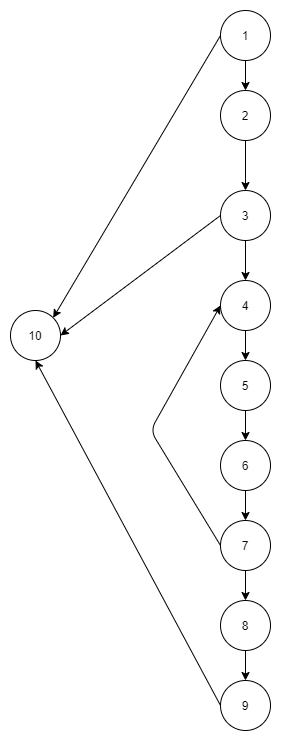

# Втора лабораториска вежба по Софтверско инженерство

## Христијана Синдилиева, 151150

### Група на код: 

Ја добив групата на код: 4

###  Control Flow Graph



### Цикломатска комплексност

Цикломатската комплексност на овој код е 4, истата ја добив преку формулата P+1, каде што P е бројот на предикатни јазли. Во случајoв P=3, па цикломатската комплексност изнесува 4.

### Тест случаи според критериумот Every branch 

Тест случаи според Every Branch критериум:
```
1. 1 - 10

2. 1 - 2 - 3 - 10

3. 1 - 2 - 3 - 4 - 5 - 6 - 7 - 4 - 5 - 6 - 7 - 8 - 9 - 10
```
Преку овие три гранки се опфаќаат сите true/false одлуки.

### Тест случаи според критериумот Every path

Тест случаи според Every Path критериум:
```
1. 1 - 10

2. 1 - 2 - 3 - 10

3. 1 - 2 - 3 - 4 - 5 - 6 - 7 - 4 - 5 - 6 - 7 - 8 - 9 - 10

4. 1 - 2 - 3 - 4 - 5 - 6 - 7 - 8 - 9 - 10
```

Според ова бројот на можни патишта е 4.


### Објаснување на напишаните unit tests

Unit тестовите кои се напишани произлегуваат од тест случаите добиени според every branch и every path критериумите, прикажани погоре.

